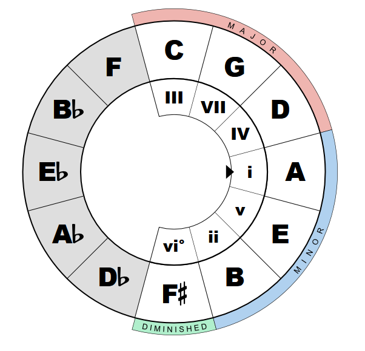

# SLIB
---
## Requirements:
- node-gyp
> Also, remember to install other necessary modules by running **npm install**
---
## Building: 
    node-gyp rebuild
---
<details>
<summary><h2>Usage:</h2></summary>

- ### Directly import
```js
var slib = require("./path/to/index.js")
```
- ### Import with npm
```bash
npm install ./path/to/module
```

&nbsp;&nbsp;&nbsp;&nbsp;&nbsp;&nbsp;&nbsp;and then in your js file
```js
var slib = require("slib")
```
</details>

---

# Documentation

## > chordsInScale(tonic, mode)
- **tonic**: string, latin note names with an optional alteration sign, e.g. "Ab" or "C#" or "F".
- **mode**: string, one of the:
  - "Ion" - Ionian (major),
  - "Dor" - Dorian,
  - "Phy" - Phrygian,
  - "Lyd" - Lydian,
  - "Mixolyd" - Mixolydian,
  - "Aeo" - Aeolian (minor),
  - "Loc" - Locrian.
- **Returns**: array of strings, the triad chords that can be built on the provided diatonic scale.

## > notesInScale(tonic, mode)
- **tonic**: string, latin note names with an optional alteration sign, e.g. "Ab" or "C#" or "F".
- **mode**: string, one of the:
  - "Ion" - Ionian (major),
  - "Dor" - Dorian,
  - "Phy" - Phrygian,
  - "Lyd" - Lydian,
  - "Mixolyd" - Mixolydian,
  - "Aeo" - Aeolian (minor),
  - "Loc" - Locrian.
- **Returns**: array of 2 arrays of strings, the first array is the notes the diatonic scale consists of, and the second array is the degrees of the notes in relation to the Ionian scale.

## > circleOfFifths(tonic, mode)
- **tonic**: string, latin note names with an optional alteration sign, e.g. "Ab" or "C#" or "F".
- **mode**: string, one of the:
  - "Ion" - Ionian (major),
  - "Dor" - Dorian,
  - "Phy" - Phrygian,
  - "Lyd" - Lydian,
  - "Mixolyd" - Mixolydian,
  - "Aeo" - Aeolian (minor),
  - "Loc" - Locrian.
- **Returns**: array of 2 arrays of strings, the first array is the roman numerals as the are presented in the Fourths-Fifths circle, clockwise (<a href = "https://en.wikipedia.org/wiki/Roman_numerals">Wikipedia</a>), and the second array is the notes that should be shown, first seven of them correspond to the roman numerals in the first array, clockwise.

<details>
<summary><b>Example:</b></summary>
circleOfFifths("A", "Dorian") returns 

```
[
  [
    'III', 'VII',
    'IV',  'i',
    'v',   'ii',
    'vi°'
  ],
  [
    'C',  'G',  'D',  'A',
    'E',  'B',  'F#', 'Db',
    'Ab', 'Eb', 'Bb', 'F'
  ]
]
```

So the top segment of the circle of fiths should be "C" with "III", and further go clockwise.



</details>

## > getChordShape(arr)
- ## NOT READY
- **arr**: array of 5 strings:
    - tonic
    - "min", "maj", "sus2", "sus4", "-"
    - "#5", "b5", "5", "-"
    - "add2", "add4", "6", "-"
    - "M7", "m7", "d7", "m9", "-"
- **Returns**: array of arrays of 6 strings, variants of chord positions. Each variant is what frets should be pressed, from the sixth to the first string, '0' is an open string, 'x' is a muted string, e.g. for Am(A, C, E)
```
[ 
  [ '5', '7', '7', '5', '5', '5' ], 
  [ 'x', '0', '2', '2', '1', '0' ] 
]
```
